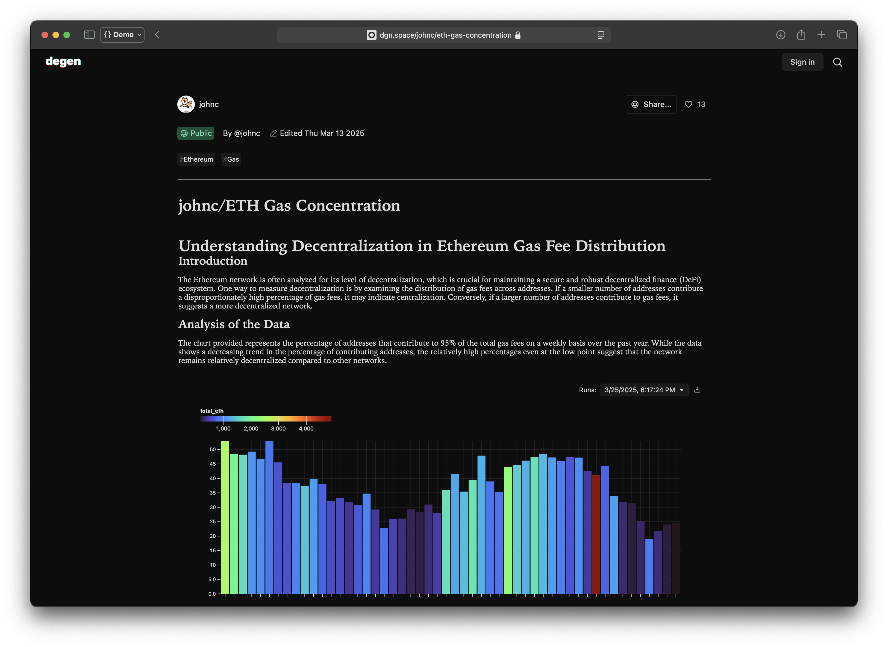

# 📝 Degen – Open-Source Decentralized Notebook for Blockchain Analytics

Degen is an **open-source, decentralized** notebook for blockchain analytics. If you've used Dune, Nansen, or Glassnode, you know the value of on-chain data—but also the pain points: **closed ecosystems, centralized control, and restricted data access**.

Degen flips the model by giving **anyone** full control to **query, remix, and share** blockchain insights transparently.

## Preview



🚀 **Live**: [dgn.space](https://dgn.space)

---

## ✨ Features

- **SQL-First Analytics** – Run and share **custom queries** on blockchain data.
- **Fully Open Data** – No silos, **all on-chain data is queryable**.
- **Decentralized & Composable** – Own your insights, **no centralized control**.
- **Blazing-Fast Queries** – Built on **ClickHouse + SQLite (Turso)** for speed.
- **Notebook-Style UI** – Write, visualize, and share analytics seamlessly.
- **Data Visualization** – Interactive charts powered by **Plot**.
- **Markdown Support** – Rich-text documentation using **Marked.js**.

---

## 🛠️ Tech Stack

Degen is built with modern web technologies:

- **Frontend**: [Svelte](https://svelte.dev/docs/svelte) + [SvelteKit](https://svelte.dev/docs/kit)
- **Database**: [Turso (SQLite)](https://turso.tech/)
- **ORM / Query Builder**: [Drizzle](https://orm.drizzle.team/)
- **Markdown Parsing**: [Marked.js](https://marked.js.org/)
- **Data Visualization**: [Plot](https://observablehq.com/@observablehq/plot)

---

## 🚀 Getting Started

### 1️⃣ Clone the Repository

```sh
git clone https://github.com/agnosticeng/degen.git
cd degen
```

### 2️⃣ Install Dependencies

```sh
npm install
```

### 3️⃣ Run the Development Server

```sh
npm run dev
```

The app should now be running at **http://localhost:5173**.

---

## 🤝 Contributing

We welcome contributions! Feel free to submit **issues** and **pull requests** to improve the project.

---

## 📜 License

Degen is **MIT-licensed**. See [LICENSE](./LICENSE) for details.

---

## 📢 Feedback & Support

We’d love your feedback! What’s missing? What would make it more useful?

🔗 **Try it out**: [dgn.space](https://dgn.space)  
💬 **Join the discussion**: [GitHub Issues](https://github.com/agnosticeng/degen/issues)
